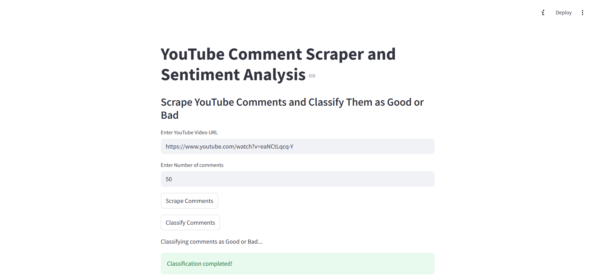
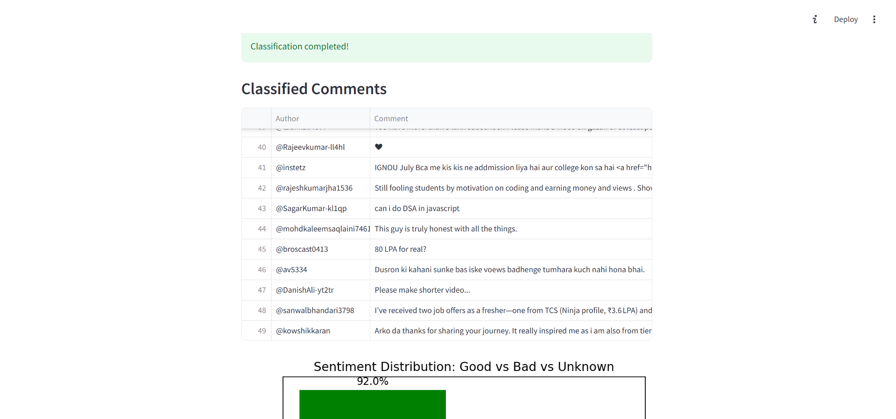
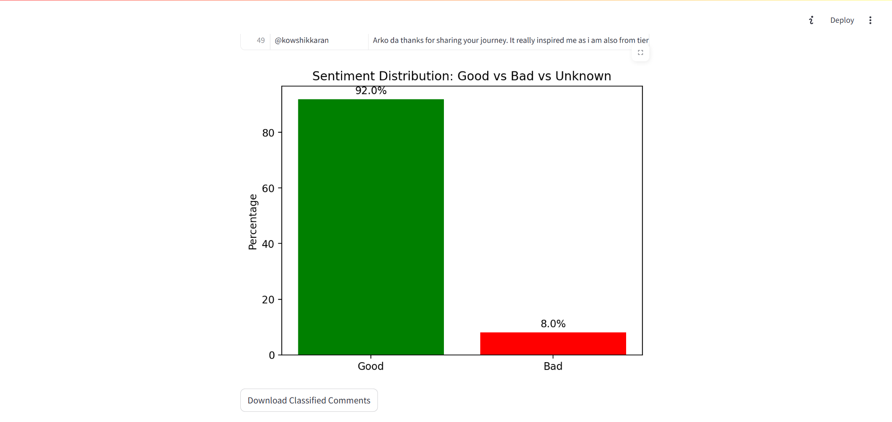

## 📊 YouTube Comment Sentiment Analyzer (Telugu/Code-Mixed)

This Streamlit web app scrapes comments from a public YouTube video and classifies each one as **Good** or **Bad** using **Google's Gemini 2.5 Flash** model.  
It supports **Telugu** and **Telugu-English code-mixed** comments.

---

## 🚀 Features

- 🔍 Scrape top-level comments from a YouTube video using the YouTube Data API  
- 🧠 Classify comments into **Good** or **Bad** using **Google Gemini 2.5 Flash**  
- 📊 Visualize sentiment distribution in a **bar chart**  
- 📁 Download results as CSV  
- 🌐 Simple and interactive **Streamlit UI**  

---

## 🧠 Sentiment Definitions

| Label       | Meaning                                      |
|-------------|----------------------------------------------|
| ✅ **Good** | Positive, neutral, or constructive           |
| ❌ **Bad**  | Abusive, offensive, negative, or harsh       |

---

## 📁 Project Structure

📦 YTSentimentalAnalyzer/
├── sample.csv # Scraped raw YouTube comments
├── labeled_comments.csv # Labeled sentiment results
├── your_script.py # Main Streamlit app
├── .env # Environment variables (API keys)
├── .gitignore # Ignored files (e.g., .env, .csv)
└── README.md # This documentation

---

## ⚙️ Setup Instructions

### 1. Clone this repository

git clone https://github.com/your-username/your-repo.git
cd your-repo

### 2. Install required packages

pip install streamlit pandas selenium google-api-python-client google-generativeai matplotlib python-dotenv webdriver-manager

### 3. Create a .env file
Store your API keys securely:
GEMINI_API_KEY=your_gemini_api_key
YOUTUBE_API_KEY=your_youtube_api_key
⚠️ Don’t forget to add .env to your .gitignore.

### 4. Run the app
streamlit run your_script.py

### 📈 Example Workflow
1.Paste a YouTube video URL

2.Enter how many comments to scrape (e.g., 50)

3.Click Scrape Comments → Extracts comments via YouTube API

4.Click Classify Comments → Gemini classifies them in batch

5.View classification + sentiment distribution bar chart

6.Optionally download the results as CSV

## 📷 Screenshots

## 📌 Future Improvements
1.💬 Scraping from Instagram and LinkedIn (login + GraphQL/API)

2.🏷️ Multi-language sentiment classification

3.🧠 Integration with custom fine-tuned models

4.⏱️ Time-based trend analysis

## 🛡️ License
This project is released under the MIT License.

## 🙋‍♂️ Author
Created by Badireddi Yaswanth Kumar – feel free to fork or contribute!